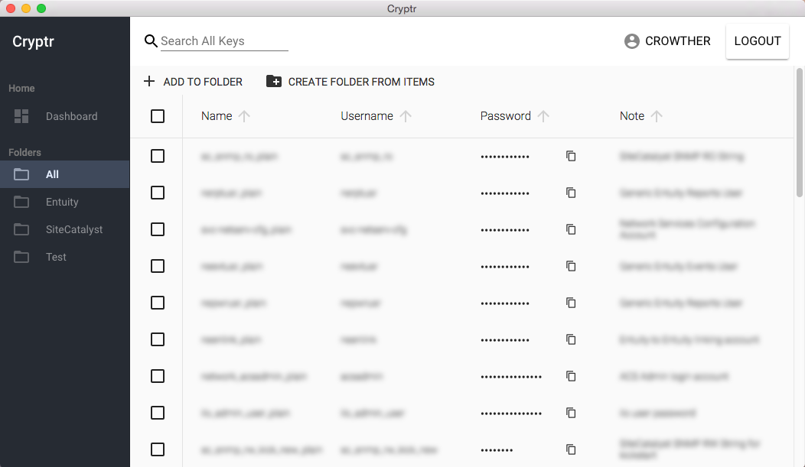

# Cryptr

Cryptr is a GUI for [Hashicorp's Vault](https://www.vaultproject.io/).

Using Cryptr, a user may manage secrets in their Vault instance: reading, creating, and modifying secrets with ease.



## Download Binaries

The current release can be [downloaded here](https://github.com/adobe/cryptr/releases).

Cryptr supports Windows, Linux and macOS. It has been tested on Windows 10, Ubuntu 17.04 Desktop, and macOS 10.15 Catalina.

On macOS, you may be warned about untrusted developers when you first attempt to launch Cryptr. To resolve this, open Finder, navigate to Applications, right-click on Cryptr.app and click Open. You can then confirm you want to allow Cryptr to be opened.

For *Linux*, use the `.AppImage` files. They are self-contained binaries that run on every major linux distro. Just make it executable and run it. [AppImage information here!](https://appimage.org/)

## Install using Homebrew

Cryptr can be installed via Homebrew where Cryptr is available as a cask. Just type

```
brew cask install cryptr
```

## Building from Source

You only need to do this if you want to contribute code, or run Cryptr in developer mode. (For Linux binaries, see above).

```
git clone https://github.com/jcrowthe/cryptr.git
cd cryptr
npm install
npm run dev
```

## Unique Features

In addition to the default feature-set of Vault, Cryptr adds some things that are "nice to have". Some of these include:

- Files can be uploaded and downloaded directly to and from the filesystem. This includes both text and binary files.
- A "share secret" features allows one user to send another user a time-limited self-destructing secret. This can be useful to send a secret to a friend without needing to change the receiving party's access in Vault.
- Underscores in key names show as whitespace. ie. `secret/My_cool_Secret` shows up in the folder structure as `My cool Secret`
- Secrets can be easily moved or renamed using a friendly UI.

## License
Apache 2.0 License

### Auth backends

Currently LDAP, UserPass and Token auth backends are accepted. Most others are not useful for a GUI, but if you feel otherwise, submit a pull request or open an issue.

# Important Notes about Policies

## Secret Discovery

Cryptr requires that policies associated with a token to be readable by that token. The purpose for this is to discover what secrets are available to the token. An example ACL for a policy found at `sys/policy/demo` would be as follows:


```
path "secret/mysecrets/*" {
  policy = "write"
}

path "sys/policy/demo" {
    policy = "read"
}
```

Only the permission to `read` is advised for the policy. **NOTE: This policy addition is _critical_ to discovering available secrets.** Without this, there is no programatic way for Cryptr to know what secrets it can query to show the user. (Also, for that matter, there is no way for a human using the CLI to discover secrets, except for blindly attempting to `list` potential folders). As such, it is **highly** recommended to do this for all policies. All policies without this ability must necessarily be ignored by Cryptr.

### Globs and Secret Discovery

Cryptr currently only supports glob characters at the folder level (ie. `secret/*`), and not as a suffix (ie. `secret/group*`). This is due to the lack of any ability to list based on a prefix. As noted [here](https://www.vaultproject.io/docs/concepts/policies.html#list), `list` command outputs are not filtered by policy. You are welcome to add `list` permissions on the containing folder, but know that this is not recommended.
