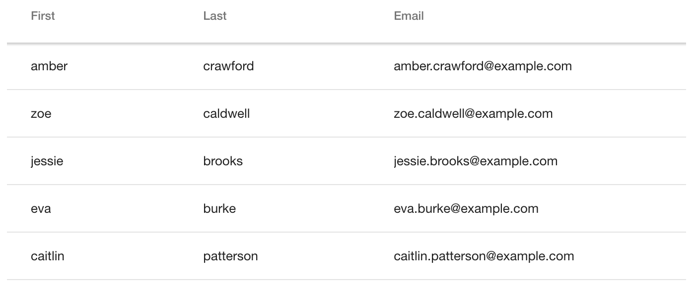

[[vaadin-grid.data]]
= Assigning Data

In this section, we will show you how to get started with assigning data to your [vaadinelement]#vaadin-grid#.
We will go through the basics of using HTML and JSON objects to generate a grid that looks like in <<figure.vaadin-grid.data.overview>>.

[[figure.vaadin-grid.data.overview]]
.A [vaadinelement]#vaadin-grid# displaying data with three columns

For more advanced data assignment topics, see <<vaadin-grid-lazy-loading#vaadin-grid.lazy-loading, "Lazy Loading and Remote Data">>.

[[vaadin-grid.data.html]]
== Using Data from an HTML Table

The easiest way to assign data into [vaadinelement]#vaadin-grid# is to use an HTML table.
To get started, you can take any existing [elementname]#table# element and place it inside the [vaadinelement]#vaadin-grid# element.

To define the number of columns displayed, you need to insert [elementname]#col# elements inside the [elementname]#table# element.
You can wrap them inside a [elementname]#colgroup# element as in the example below, but that is optional.
Headers for each column can be configured using [elementname]#th# elements in the [elementname]#thead# section.

[source,html]
----
<vaadin-grid>
  <table>
    <colgroup>
      <col>
      <col>
      <col>
    </colgroup>
    <thead>
      <tr>
        <th>First</th>
        <th>Last</th>
        <th>Email</th>
      </tr>
    </thead>
    <tbody>
      <tr>
        <td>amber</td>
        <td>crawford</td>
        <td>amber.crawford@example.com</td>
      </tr>
      <tr>
        <td>zoe</td>
        <td>caldwell</td>
        <td>zoe.caldwell@example.com</td>
      </tr>
      <tr>
        <td>jessie</td>
        <td>brooks</td>
        <td>jessie.brooks@example.com</td>
      </tr>
      <tr>
        ...
      </tr>
    </tbody>
  </table>
</vaadin-grid>
----

[[vaadin-grid.data.object]]
== Using Object Values

When using objects as data, you can provide the array of objects to [vaadinelement]#vaadin-grid#.

First, you need to define the columns and a mapping between object properties and the columns.
You can do this using the [elementname]#col# elements and its `name` attribute, as in the example below.

[source,html]
----
<vaadin-grid>
  <table>
    <colgroup>
      <col name="user.name.first">
      <col name="user.name.last">
      <col name="user.email">
    </colgroup>
  </table>
</vaadin-grid>
----

Optionally, you can dismiss the whole [elementname]#table# element and configure the columns using the JavaScript API.
See the following example and also <<vaadin-grid-columns#vaadin-grid.columns, "Configuring Columns">> for more details.

[source,javascript]
----
grid.columns = [
  { name: 'user.name.first' },
  { name: 'user.name.last' },
  { name: 'user.email' }
];
----

If you do not provide a [elementname]#thead# element for the header, headers will be automatically generated
from the `name` attributes, as described in <<vaadin-grid-headers#vaadin-grid.headers, "Customizing Headers and Footers">>.

After you have configured the columns, you can go ahead and assign the data array to the [propertyname]#items# property of the grid.

[source,javascript]
----
grid.items = [
  {
    user: {
      name: { first: 'amber', last: 'crawford' },
      email: 'amber.crawford@example.com'
    }
  },
  {
    user: {
      name: { first: 'zoe', last: 'caldwell' },
      email: 'zoe.caldwell@example.com'
    }
  },
  {
    user: {
      name: { first: 'jessie', last: 'brooks' },
      email: 'jessie.brooks@example.com'
    }
  }
  ...
];
----

ifdef::web[]
====
See the link:https://cdn.vaadin.com/vaadin-elements/latest/vaadin-grid/demo/datasources.html[live example].
====
endif::web[]

[[vaadin-grid.data.primitive]]
== Using Primitive Values

When your data consists of primitive values, columns are mapped by indexes instead of the `name` property.

First, you need to define a column by a [elementname]#col# element without
a `name` attribute, as done in the following example, or by using the JavaScript API, as described in <<vaadin-grid-columns#vaadin-grid.columns, "Configuring Columns">>.

[NOTE]
The header auto generation does not apply here because we are missing the `name` property, so you also _have to_ define a [elementname]#thead# element.

[source,html]
----
<vaadin-grid>
  <table>
    <colgroup>
      <col>
    </colgroup>
    <thead>
      <tr>
        <th>First Name</th>
      </tr>
    </thead>
  </table>
</vaadin-grid>
----

After you have configured the columns, you can go ahead and assign the data.

[source,javascript]
----
grid.items = ['amber', 'zoe', 'jessie', 'eva', ...]
----

In case you need more than one column, add another pair of [elementname]#col# and [elementname]#th# elements and provide the data
using nested arrays.

[source,javascript]
----
grid.items = [
  ['amber', 'crawford'],
  ['zoe', 'caldwell'],
  ['jessie', 'brooks'],
  ...
]
----

ifdef::web[]
====
See the link:https://cdn.vaadin.com/vaadin-elements/master/vaadin-grid/demo/datasources.html[live example].
====
endif::web[]

[[vaadin-grid.data.dynamic]]
== Using Dynamic Data

If the data can change dynamically, [vaadinelement]#vaadin-grid# must be notified of the changes.

You can define the size of the active dataset with the `size` property of [vaadinelement]#vaadin-grid#.
If you add or remove items, you need to update the size accordingly.
Like any other property, `size` can also be applied as an attribute.
[source,html]
----
<vaadin-grid size="100"></vaadin-grid>
----

[NOTE]
When using arrays as data, the `length` of the original item array is set as the initial `size`.

[source,javascript]
----
// In this case, grid.items.push(...); would do the same,
// but using grid.push('items', ...); is preferred.
grid.push('items', {
  user: {
    name: { first: 'eva', last: 'burke' }, email: 'eva.burke@example.com'
  }
});

// Increase the size after pushing a new item.
grid.size++;
----

If the data changes, you need to call [methodname]#refreshItems()#.
The [methodname]#refreshItems()# method is used to trigger [vaadinelement]#vaadin-grid# to refresh the displayed data.

[source,javascript]
----
grid.items[0].email = 'amber.crawford@example.co.uk';
grid.refreshItems();
----

ifdef::web[]
====
See the link:https://cdn.vaadin.com/vaadin-elements/master/vaadin-grid/demo/datasources.html[live example].
====
endif::web[]
