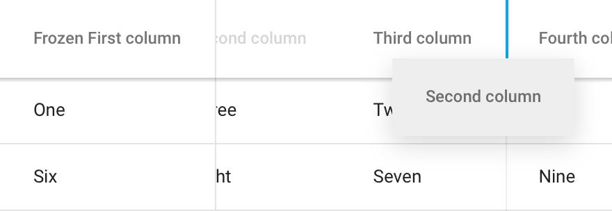
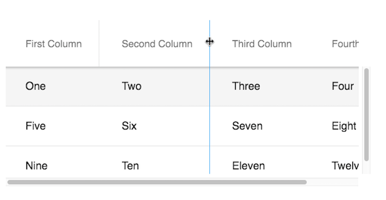

[[vaadin-grid.columns]]
= Configuring Columns

This section describes configuration options for the columns in [vaadinelement]#vaadin-grid#.

[[vaadin-grid.columns.defining]]
== Defining the Columns
You can define the columns in a [vaadinelement]#vaadin-grid# with [elementname]#col# elements.
These elements should be placed inside a [elementname]#colgroup# wrapper inside a [elementname]#table# element.

To define the captions of the columns, you should use [elementname]#th# elements inside a table row wrapped in a [elementname]#thead# element.
See the following example for a simple two-column configuration.
[source,html]
----
<vaadin-grid>
  <table>
    <colgroup>
      <col>
      <col>
    </colgroup>
    <thead>
      <tr>
        <th>First column</th>
        <th>Second column</th>
      </tr>
    </thead>
    <tbody>
      <tr>
        <td>One</td>
        <td>Two</td>
      </tr>
    </tbody>
  </table>
</vaadin-grid>
----

An alternative way to define the columns is to use the JavaScript API.
You can modify the columns through the [propertyname]#grid.columns# array.
[source,javascript]
----
// Columns can also be configured in JavaScript.
grid.columns = [
  { name: "firstColumn" },
  { name: "secondColumn" }
];
----

[[vaadin-grid.columns.dynamic]]
== Adding and Removing Columns Dynamically

The [vaadinelement]#vaadin-grid# element has a JavaScript API for dynamically inserting and removing columns.
To add a column, you can use the [methodname]#addColumn()# method, which takes a column object and an optional index or column name as its parameters.

[source,javascript]
----
// Add a column as the last column of the grid.
grid.addColumn({name: 'secondColumn'});

// Specify the index or name of the column before which to add the new column.
grid.addColumn({name: 'firstColumn'}, 0);
----

In order to remove columns, there is a method called [methodname]#removeColumn()#, which takes the column index or name as a parameter.

[source,javascript]
----
// Remove the first column of the grid.
grid.removeColumn(0);

// Remove the second column of the grid.
grid.removeColumn('secondColumn');
----

[[vaadin-grid.columns.width]]
== Defining Column Widths
By default all the columns share the available size equally.
You can use the [propertyname]#column.flex# property to adjust how much a column spans in width relative to other columns.
Columns may also be assigned an explicit width, a maximum width and a minimum width with [propertyname]#column.width#, [propertyname]#column.maxWidth#, and [propertyname]#column.minWidth# properties.

[source,html]
----
<vaadin-grid>
  <table>
    <colgroup>
      <col width="100" flex="1">
      <col max-width="200" flex="2">
      <col min-width="100" flex="1">
    </colgroup>
    <!-- ... -->
  </table>
</vaadin-grid>
----

[source,javascript]
----
// Setting the width properties with JavaScript API.
grid.columns[0].width = 100;
grid.columns[1].maxWidth = 200;
grid.columns[2].minWidth = 100;

// Setting the flex properties with JavaScript API.
grid.columns[0].flex = 1;
grid.columns[1].flex = 2;
grid.columns[2].flex = 1;
----

[[vaadin-grid.columns.frozen]]
== Frozen Columns
A number of columns starting from the left may be set as "frozen".
The setting forces them to remain horizontally still while the rest of the columns scroll normally.

You can do this by setting the number of frozen columns in the [propertyname]#grid.frozenColumns# property or declaratively using the `frozen-columns` attribute.
In multi-select mode, the selection column, which contains the checkboxes, is frozen by default.
Setting [propertyname]#grid.frozenColumns# to -1 will unfreeze it as well.
[source,javascript]
----
// Define a single column to be frozen
grid.frozenColumns = 1;
----

[[vaadin-grid.columns.hiding]]
== Hiding Columns
Columns can be either hidden or visible, which is determined by the [propertyname]#column.hidden# property.
Another property called [propertyname]#column.hidable# can be used to make some columns hidable by the user.
Setting a column's [propertyname]#hidable# property to `true` includes it in a drop-down menu on the right side of the column headers, where individual columns can be toggled hidden/visible by the user.

[[figure.vaadin-grid.column-hiding]]
.User can toggle column visibility with the drop-down
image::img/vaadin-grid-column-hiding.png[]

[source,html]
----
<vaadin-grid>
  <table>
    <colgroup>
      <col>
      <col hidable>
      <col hidable hidden>
      <col hidden>
    </colgroup>
    <!-- ... -->
  </table>
</vaadin-grid>
----
[source,javascript]
----
// Setting the properties with JS API
grid.columns[1].hidable = true;
grid.columns[2].hidable = true;
grid.columns[2].hidden = true;
grid.columns[3].hidden = true;
----

ifdef::web[]
====
See the link:https://cdn.vaadin.com/vaadin-elements/latest/vaadin-grid/demo/columns.html[live example].
====
endif::web[]

[[vaadin-grid.columns.reordering]]
== Column Reordering
The end users can reorder non-frozen columns by dragging the header cells.
By default, column reordering is disabled, but it can be enabled by setting the [propertyname]#columnReorderingAllowed# property to true.

Column reordering works only when the data source is based on objects bound to the column configuration using the `name` attribute.
Usage of object values is described in section <<vaadin-grid-assigning-data#vaadin-grid.data.object, "Using Object Values">>.

When using arrays as data, you need to take care of reordering the data after the column order is changed.
You will get notified of this by listening to the `column-order-changed` event.

[[figure.vaadin-grid.column-reordering]]
.User can drag the header cells to reorder the columns

[source,html]
----
<vaadin-grid column-reordering-allowed>
  <!-- ... -->
</vaadin-grid>
----
[source,javascript]
----
// Setting the property with JS API
grid.columnReorderingAllowed = true;
----
[source,javascript]
----
// Listening to column order changes
grid.addEventListener('column-order-changed', function() {
  var columnNames = grid.columns.map(function(col) { return col.name; });
  console.log('Column order is now: ' + columnNames.join(', '));
});
----

ifdef::web[]
====
See the link:https://cdn.vaadin.com/vaadin-elements/latest/vaadin-grid/demo/columns.html[live example].
====
endif::web[]

[[vaadin-grid.columns.resizing]]
== Column Resizing
Columns can be resized by dragging the separation line in headers. By default it is disabled. Set the [propertyname]#column.resizable# property to a column to make it resizable.

When a column is resized, you will get notified by listening to the `column-resized` event.

[[figure.vaadin-grid.column-resizing]]
.User can drag the header separator to resize the column.

[source,html]
----
<vaadin-grid>
  <table>
    <colgroup>
      <col>
      <col resizable>
    </colgroup>
    <!-- ... -->
  </table>
</vaadin-grid>
----
[source,javascript]
----
// Setting the properties with JS API
grid.columns[0].resizable = false;
grid.columns[1].resizable = true;
----

ifdef::web[]
====
See the link:https://cdn.vaadin.com/vaadin-elements/latest/vaadin-grid/demo/columns.html[live example].
====
endif::web[]
