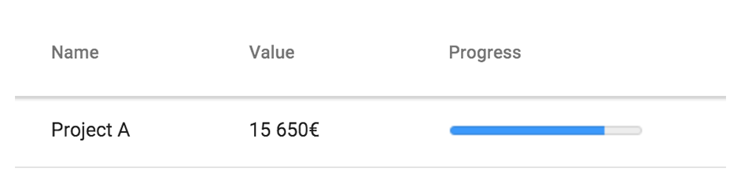

[[vaadin-grid.formatting]]
= Data Formatting

In the <<vaadin-grid-assigning-data#vaadin-grid.data, "Assigning Data">> section, we learned how to assign data items to be displayed as the rows of the Grid.
You often need to format data in a more suitable way for displaying it in the user interface.
This section explains how to format your data before it is displayed in [vaadinelement]#vaadin-grid#.

[[vaadin-grid.formatting.inline]]
== Inline Data

If you are providing the data for the grid with an inline HTML [elementname]#table#, you can have any HTML elements in the grid cells.
In the following example, we use a [elementname]#progress# element within the provided data.

[source,html]
----
<vaadin-grid>
  <table>
    [...]
      <tr>
        <td>Project A</td>
        <td>15 650€</td>
        <td><progress value="0.8"></progress></td>
      </tr>
  </table>
</vaadin-grid>
----

[[figure.vaadin-grid.formatting.inline]]
.Adding an HTML element into a cell

[[vaadin-grid.formatting.renderers]]
== Using Data Renderers

When providing data as an array of items or as a datasource function, you can use a renderer function to format the data.
Each column can be given a renderer function with their [propertyname]#renderer# property.

A renderer function will get a reference to the cell being rendered as a parameter.
This reference can be used to manipulate the `innerHTML` property of the cell or, for example, use the standard DOM API to append a child element.

For example, if you have numeric data and want to represent it with a [elementname]#progress# element, as we did in an earlier example with inline HTML, you can write a renderer function such as the following:

[source,javascript]
----
var progressRenderer = function(cell) {
  cell.element.innerHTML = '';

  var progressElement = document.createElement('progress');
  progressElement.setAttribute('value', cell.data);
  cell.element.appendChild(progressElement);
};
----

After you have defined the function, you still need to hook it into a column in the grid.
You can do this by using the [propertyname]#grid.columns# array as follows.

[source,javascript]
----
grid.columns[2].renderer = progressRenderer;
----
