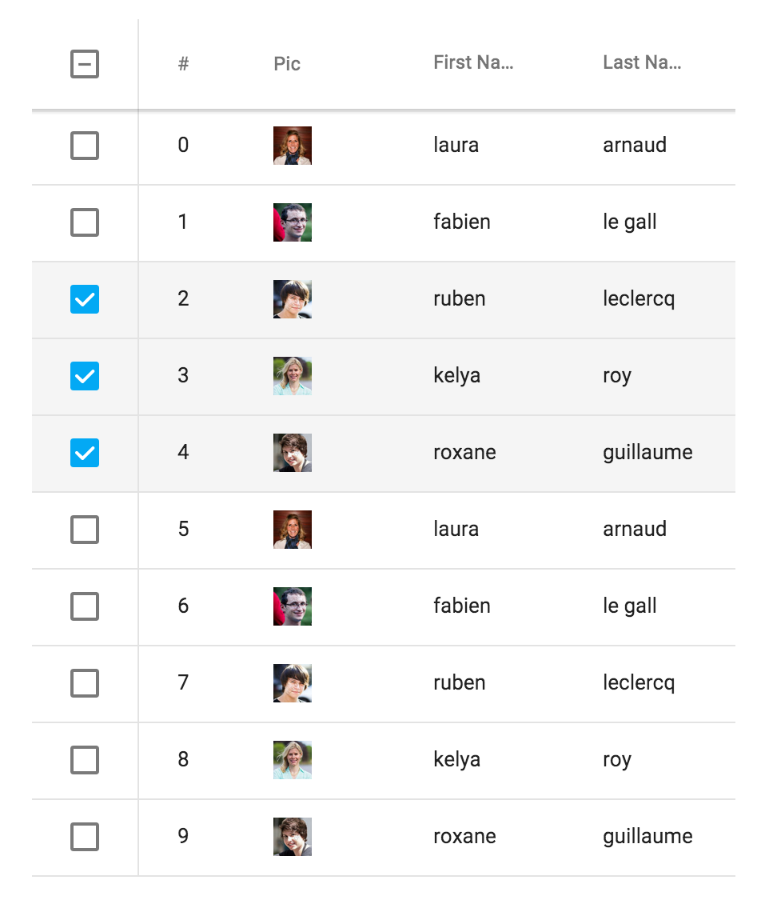

[[vaadin-grid.overview]]
= Overview

The [vaadinelement]#vaadin-grid# element is a Polymer element that can be used to display large amounts of tabular data.

[[figure.vaadin-grid.overview]]
.A screenshot of the [vaadinelement]#vaadin-grid# element

== Features

- Support for `Array` data or lazy loading with functions
- Renderer functions for data formatting
- Configurable headers and footers
- Frozen columns
- Selecting row(s)
- Sorting and filtering
- Styling with CSS custom properties and mixins
- Row details drawer
