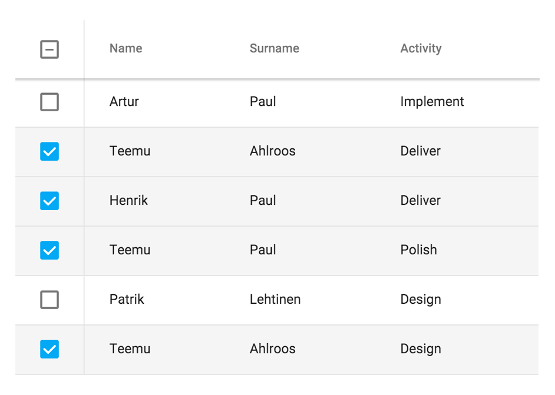

[[vaadin-grid.selection]]
= Selection

Grid allows index based selection of data rows either through UI interaction or using the JavaScript API.
The selection behavior depends on the currently active selection mode.

[[figure.vaadin-grid.selection.example]]
.A [vaadinelement]#vaadin-grid# with four rows selected

[[vaadin-grid.selection.mode]]
== Selection Mode

The [vaadinelement]#vaadin-grid# has four separate selection modes.
Defining the selection mode can be done using the [propertyname]#selection-mode# attribute or the [propertyname]#grid.selection.mode# property of the JavaScript API.

* *Single* (`single`) is the default selection mode. It allows only one row to be selected at once.
* *Multi* (`multi`) selection mode reveals an additional checkbox column allowing the user to select multiple rows.
* *All* (`all`) selection mode has each row selected by default allowing the user to deselect individual rows using an additional checkbox column.
* *Disabled* (`disabled`) disables the selection functionality.

The selection mode can also be changed by some operations in the selection API.
Also, if the user selects all items while in the `multi` selection mode, the mode will automatically change to `all`.

To get notified of changes in the selection mode, you can listen to an event named `selection-mode-changed`.

[[vaadin-grid.selection.api]]
== Selection API

This section explains the basic operations available through the selection API.

[methodname]#grid.selection.select(index)#::
  Selects the row with the given index. If the selection mode is `single`, the method deselects the previously selected row.

[methodname]#grid.selection.deselect(index)#::
  Deselects the row with the given index.

[methodname]#grid.selection.selectAll()#::
  Selects all rows and changes the selection mode to `all`.

[methodname]#grid.selection.clear()#::
  Deselects all selected rows. If the selection mode is `all`, the method will change the selection mode to `multi`.

[[vaadin-grid.selection.selected]]
== Accessing the Selected Rows

In order to access the selected row indexes, you can call [methodname]#grid.selection.selected()# method.
The return value is an array containing the currently selected indexes.

[source,javascript]
----
// Log the selections to console on select event.
// Example output: "Selected: 3,5,6"
grid.addEventListener('selected-items-changed', function() {
  console.log('Selected: ' + grid.selection.selected());
});
----

If your grid has a very large set of items and the selection mode is `all`, you may want to use the [methodname]#grid.selection.deselected()# method instead.
The method returns the indexes of rows that are _not_ selected.

The total number of selected items is always available through [propertyname]#grid.selection.size# property.
