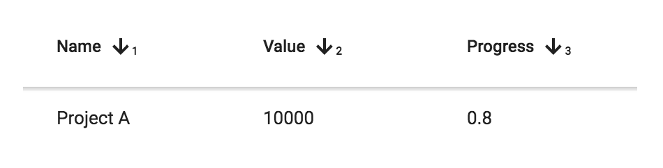

[[vaadin-grid.sorting]]
= Sorting Data

You can define which columns of the [vaadinelement]#vaadin-grid# are sortable.
This enables the user to click on the column header to update the [propertyname]#sortOrder# property.
The user can also select multiple columns for sorting by shift-clicking more column headers.

[[figure.vaadin-grid.sorting.overview]]
.A [vaadinelement]#vaadin-grid# displaying three sorting indicators

[[vaadin-grid.sorting.columns]]
== Sortable Columns

While defining the columns, you can define whether the user should be able to sort by that column or not.
This is done with the [propertyname]#sortable# property.
A predefined sorting order can also be achieved via the [propertyname]#sort-direction# attribute.
The value of [propertyname]#sort-direction# should be either `asc` or `desc` for ascending and descending sort direction.

[source,html]
----
<vaadin-grid>
  <table>
    <colgroup>
      <col sortable sort-direction="asc">
      <col sortable sort-direction="desc">
      <col sortable>
    </colgroup>
    [...]
  </table>
</vaadin-grid>
----

You can also use the JavaScript API to define sortable columns and the current sort order.
[source,javascript]
----
// Setting the sort definitions in JavaScript.
grid.columns[0].sortable = true;
grid.columns[1].sortable = true;
grid.columns[2].sortable = true;

grid.sortOrder = [
  {column: 0, direction: 'asc'},
  {column: 1, direction: 'desc'}
];
----

[[vaadin-grid.sorting.sort]]
== Sorting the Data

As mentioned in the previous example, there are multiple ways to change the sort order of [vaadinelement]#vaadin-grid#.
[vaadinelement]#vaadin-grid# provides an in-place sorting functionality for array data sources.
Other kinds of data sources are always responsible of providing appropriate data that is ordered by the sort order definitions.

You can listen for changes in the sort order by listening to the `sort-order-changed` event. When using array data sources, the
default sorting functionality can be cancelled by calling [methodname]#preventDefault()# on the event object.
See the following example for a simple case of sorting based on one sortable column.

[source,javascript]
----
// Set a data source for the grid
var data = [
  ['Project A', 10000, 0.8],
  ['Project D', 999999, 0.2],
  ['Project C', 43256, 0.01],
  ['Project E', 1967, 0.9],
  ['Project B', 19672, 1]
];
grid.items = data;

// Re-order the data array on sort-order-changed event
grid.addEventListener('sort-order-changed', function(e) {
  // cancel default sorting for arrays.
  e.preventDefault();

  var idx = grid.sortOrder[0].column;
  var lesser = grid.sortOrder[0].direction == 'asc' ? -1 : 1;
  data.sort(function(a, b) {
    return (a[idx] < b[idx]) ? lesser : -lesser;
  });
});
----

[[vaadin-grid.sorting.filtering]]
== Filtering the Data

A common requirement is also to filter the displayed data.
Unfortunately, there are not any built-in helpers for doing filtering, but you can implement the filtering in your data source.

See the following example for a function data source that uses the value from a `filterElement` to filter the provided data.
Notice that you also need to call [methodname]#refreshItems()# method in order to get the items to update after the filter is changed.
[source,javascript]
----
var filterElement = document.querySelector('#filter');
filterElement.addEventListener('input', function() {
  grid.refreshItems();
});

grid.items = function(params, callback) {
  var filterValue = filterElement.value.toLowerCase();
  var data = dataArray.filter(function(item) {
    return (item.toString().toLowerCase()).indexOf(filterValue) != -1;
  });
  var slice = data.slice(params.index, params.index + params.count);
  callback(slice, data.length);
};
----
