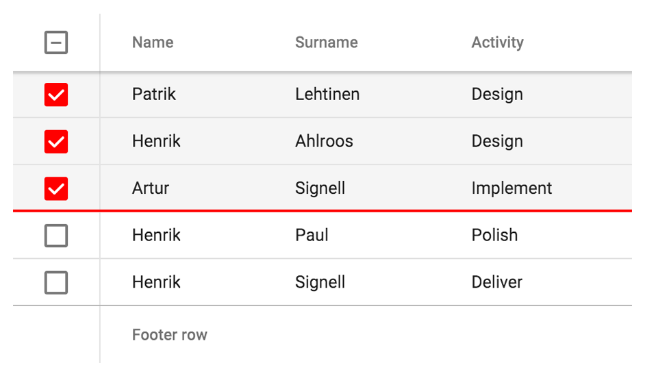

[[vaadin-grid.styling]]
= Styling

The appearance of [vaadinelement]#vaadin-grid# is designed to fit in with the https://www.google.com/design/spec/material-design/[Material Design] language from Google.
This section will explain how you can customize the look of your [vaadinelement]#vaadin-grid# to fit your own application theme.
Some CSS properties such as `font-family` will be inherited from the containing page, while others may need to be changed with custom CSS properties and mixins.

[[vaadin-grid.sorting.sizing]]
== Sizing

By default [vaadinelement]#vaadin-grid# takes all horizontal space available and set its height depending on the number of data rows.
You can change this behavior by using standard sizing properties, such as `width` and `height`.

The height can also be defined as the number of rows to be displayed by using the [propertyname]#visible-rows# attribute or [propertyname]#grid.visibleRows# JavaScript property.

[[vaadin-grid.sorting.custom]]
== Custom Properties
The [vaadinelement]#vaadin-grid# element is compatible with https://github.com/PolymerElements/paper-styles[paper-styles] from the https://elements.polymer-project.org/[Polymer Element Catalog].
The selection checkboxes and focus highlights inherit their color from the `--primary-color` defined in the `paper-styles`.

[[figure.vaadin-grid.styling.example]]
.An example of custom highlight color and row heights

You can also use some custom properties defined in [vaadinelement]#vaadin-grid#.
Currently, they include both CSS properties and mixins.
The CSS properties allow adjusting heights of different row types, while the mixins are applied on different types of row cells.

.Available custom properties
|===
|Custom property |Description	|Default value
|`--vaadin-grid-row-height`
|Data row height
|48px

|`--vaadin-grid-header-row-height`
|Header row height
|56px

|`--vaadin-grid-footer-row-height`
|Footer row height
|56px

|`--vaadin-grid-row-cell`
|Mixin applied on the cells.
|-

|`--vaadin-grid-selected-row-cell`
|Mixin applied on the cells of the selected row.
|-

|`--vaadin-grid-row-stripe-cell`
|Mixin applied on the cells of the striped rows.
|-
|===
